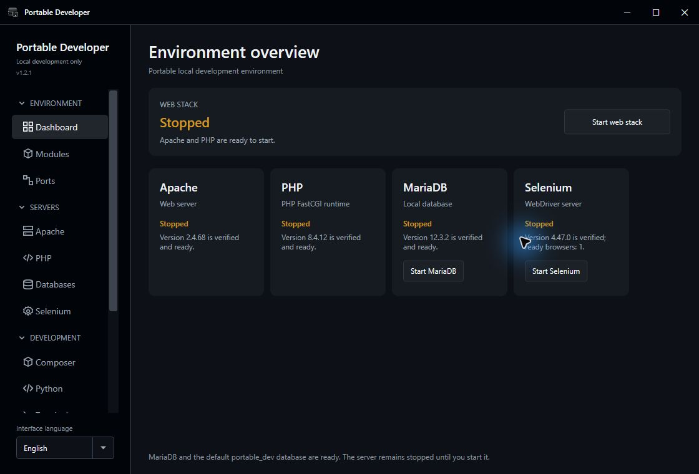

# Portable Developer

[](https://github.com/hybernia1/portable-developer/actions/workflows/ci.yml)
[](https://github.com/hybernia1/portable-developer/actions/workflows/codeql.yml)
[](https://github.com/hybernia1/portable-developer/releases/latest)
[](LICENSE)

Portable Developer is a self-contained Windows development environment for web apps and browser automation. Run Apache, PHP, MariaDB, Python, Composer and managed Selenium browsers directly from one folder — without installation, admin rights or system changes.

The application, configuration, projects, databases, optional modules, managed browsers, and automation profiles stay inside that folder or an external drive. It does not install Windows services or modify the system `PATH`, registry, file associations, hosts file, or firewall.

The project is free software under [GPL-3.0-or-later](LICENSE). Version **1.23.0** is a complete but currently unsigned release. Windows Smart App Control or SmartScreen may block it; do not disable Windows security to run the application. See the [Code signing policy](docs/CODE_SIGNING_POLICY.md).



_The environment overview in Portable Developer 1.2.1 with the optional web, database, Selenium, Composer, and Python modules installed._

## Highlights

- Self-contained WPF application; the host does not need .NET, Python, Java, or a Visual C++ runtime installation.
- Explicit in-app installation of Apache, PHP, MariaDB, Selenium/OpenJDK, Composer, Python, Notepad++, and phpMyAdmin.
- Pinned HTTPS sources, SHA-256 verification, safe archive extraction, atomic installation, repair, and cleanup of obsolete managed runtimes.
- Conditional navigation: pages appear only when their required module is installed and verified.
- Apache projects with independently installed PHP, `.localhost` virtual hosts, per-project web roots, and optional `.htaccess` support.
- MariaDB database management and local phpMyAdmin.
- Selenium with app-managed Chrome for Testing or Firefox, matching drivers, immutable authenticated master profiles, encrypted cookie vaults, persistent project downloads, session limits, and cleanup of transient session data.
- Composer and Python package management scoped to portable project directories.
- Restricted project terminal, project-rooted file manager, and optional portable editor.
- Czech and English application UI; English is the canonical documentation language.
- Storage management for disposable download, package, Composer, pip, and Selenium caches without touching projects, databases, profiles, cookie vaults, or downloads.

Portable Developer is not an operating-system sandbox. PHP, Python, Composer packages, Selenium tests, and project code run with the current Windows user's permissions.

## Quick start

1. Download the Windows x64 ZIP and adjacent `.sha256` file from [GitHub Releases](https://github.com/hybernia1/portable-developer/releases/latest).
2. Verify the archive before extraction:

   ```powershell
   Get-FileHash .\PortableDeveloper-win-x64-1.23.0.zip -Algorithm SHA256
   ```

3. Extract the complete ZIP to a writable folder or external drive.
4. Run `PortableDeveloper.exe` and install only the modules you need from the Modules page.
5. Start Apache, MariaDB, or Selenium independently from the dashboard.

The small base ZIP contains the application, catalogs, notices, and app-local Visual C++ support. Optional modules are downloaded only after an explicit install action. The application accepts neither arbitrary package URLs nor remote catalog replacement.

## Host-system boundary

| Host change | Portable Developer behavior |
|---|---|
| Administrator rights | Not required |
| Windows services or drivers | Never installed |
| System `PATH`, registry, file associations, hosts, or firewall | Never modified |
| Apache, PHP, MariaDB, and Selenium listeners | Bound to `127.0.0.1` only |
| Optional module downloads | Explicit user action, allowlisted HTTPS source, pinned SHA-256 |
| Projects, databases, logs, profiles, and settings | Stored below the portable application root |

See the [security model](docs/SECURITY_MODEL.md), [architecture](docs/ARCHITECTURE.md), and [portability contract](docs/PORTABILITY.md) for the complete boundaries.

## Build and test

The required .NET SDK is pinned in `global.json`, and the external NuGet test-toolchain graph is committed in `packages.lock.json`.

```powershell
dotnet restore PortableDeveloper.slnx --locked-mode
dotnet format PortableDeveloper.slnx --verify-no-changes --no-restore
dotnet build PortableDeveloper.slnx --configuration Release --no-restore
dotnet test PortableDeveloper.slnx --configuration Release --no-build --no-restore
```

Create the public-style online package with:

```powershell
.\scripts\Publish-Online-Windows.ps1 -Version 1.23.0
```

The tag workflow rebuilds the self-contained layout from public source and publishes the ZIP, checksum, SPDX SBOM, and GitHub build-provenance attestation.

## Privacy, security, and removal

Portable Developer contains no telemetry, analytics, advertising SDK, automatic crash upload, or automatic update check. Network access occurs only because of an explicit user action or user project code. See [Privacy](PRIVACY.md), [Security](SECURITY.md), [security model](docs/SECURITY_MODEL.md), and [third-party notices](THIRD-PARTY-NOTICES.md).

To remove the application, stop its services, close it, and delete its folder. Back up `instances/`, `profiles/`, and project downloads first if they should be retained. No service, registry entry, firewall rule, or system `PATH` entry remains.

## Contributing and documentation

Contributions are welcome under GPL-3.0-or-later without a CLA or copyright assignment. See [Contributing](CONTRIBUTING.md), [Governance](GOVERNANCE.md), and the [Code of Conduct](CODE_OF_CONDUCT.md).

The [documentation index](docs/README.md) links the architecture, package, runtime, security, privacy, release, and contributor material.

## Code signing policy

Future official binaries will be signed only after project approval under the public [Code signing policy](docs/CODE_SIGNING_POLICY.md) and documented [SignPath integration boundary](docs/SIGNPATH_INTEGRATION.md). **Free code signing provided by [SignPath.io](https://signpath.io/), certificate by [SignPath Foundation](https://signpath.org/).** Only `PortableDeveloper.exe`, built from this repository, is eligible for the project signature; upstream tools and runtime libraries retain their own signatures or unsigned state. Every future signing request requires separate manual approval.
