# UI polishing notes

This document records the agreed visual direction for the post-1.30 polishing pass. The screenshots are design references, not pixel-perfect specifications and not application assets. Production UI should continue to use native WPF controls, the system Fluent theme, and reusable vector or font glyphs.

## Shared component language

- Prefer one flat, bounded collection row over a table, nested cards, or a large selectable surface.
- Lead with identity: technology icon, strong item name, then a subdued path or description.
- Replace repetitive field captions with familiar icons only where the value remains unambiguous.
- Keep text on the primary action. Secondary edit/delete actions may be icon-only when they have a tooltip, `AutomationProperties.Name`, keyboard focus, and a sufficiently large hit target.
- Keep optional recurring explanations behind a familiar info action in the section header. The action needs a localized tooltip and automation name; validation, security decisions, failures, and recovery guidance stay inline.
- Use semantic color locally: green for an enabled or healthy state, red for a failure or destructive action, and the Windows accent for the primary action. Do not tint an entire row.
- Keep spacing calm but compact. The generated concepts are hierarchy references; production rows should be slightly denser.
- At compact widths, wrap metadata and move the action group below the identity instead of shrinking controls or introducing horizontal scrolling.
- Preserve native Fluent focus, hover, pressed, disabled, high-contrast, light/dark, and accent behavior. Do not re-template standard controls just to match a raster concept.
- Use one coherent glyph family and consistent optical size throughout the application. Product/runtime identities may retain their recognizable technology marks.

## Feedback lifetime

- Use the floating transient confirmation only for completed, noncritical actions such as copying an ID, saving a preference, or a create/update/remove result already visible in the page.
- Short form submissions may use the same host for an actionable failure when the responsible native input is focused, marked with the critical system brush, and receives the localized message as accessible help; MariaDB password validation follows this pattern.
- Keep validation, failures, restart requirements, missing dependencies, service state, and progress beside the control or card that owns them.
- Successful refresh and external-window launch need no confirmation when the updated content or opened window is sufficient feedback.
- Show only the latest transient confirmation for seven seconds, pause its timeout on hover, provide a close action, and announce it as a polite automation live region.
- Do not stack confirmations, retain a notification history, or use Windows app notifications for these in-application results.

## Selenium browser catalog

- The browser package catalog is the single visual inventory for managed browser environments. Its installed state and version already communicate readiness.
- Keep Refresh as a catalog-header action, but do not repeat installed packages in a second “Managed browsers” card or maintain a second presentation projection.

## Catalog creation workflows

- Keep profile masters, cookie vaults, and databases as full-width overview catalogs rather than pairing them with always-visible creation forms.
- Place Add/Create beside the catalog identity in the shared section header and open the existing native dialog grammar for short-lived fields.
- Do not retain a canceled profile name, browser selection, import path, vault name, or database name in the page model. Persistent rows, operation progress, and actionable failures remain in the owning page.
- Keep security and service configuration forms inline when their state or guidance should remain continuously visible; the MariaDB root-password form is intentionally not moved into this pattern.

## Icon catalog

- Keep neutral navigation, object, status, and action icons as semantic WPF `Geometry` resources in `Assets/Icons.xaml`. The resource name describes intent (`IconRefresh`, `IconDelete`, `IconPackage`), not a visual implementation detail.
- Render catalog geometries only through the shared `AppIcon` control. It owns optical size, stroke weight, rounded line treatment, and inherited `Foreground`; pages must not repeat raw `Path` presentation settings.
- Use 16 px for ordinary commands and metadata, 20 px for emphasized object identity, and 24 px or larger only for empty states or page-level identity.
- Let `AppIcon` inherit a native Fluent foreground or an explicit semantic theme brush. Never embed concrete colors in neutral icon geometry.
- Keep recognizable technology marks in `Assets/Logos/*.svg` and render them through `BrandLogo` with their existing fixed brand brushes. Brand SVGs and neutral application icons are separate catalogs with separate responsibilities.
- WPF geometry is the runtime source of truth. Individual upstream SVG files may be retained later as development inputs, but the application must not add an SVG parser or depend on a monolithic runtime SVG sprite.
- Keep text on primary and unfamiliar commands. An icon-only tertiary command requires a tooltip, localized `AutomationProperties.Name`, visible keyboard focus, and a native button hit target.
- Source checks must cover unique catalog keys, required semantic icons, shared-control usage, and the absence of new page-local icon drawing conventions.

## Scheduler task catalog

| Current | Direction |
| --- | --- |
| 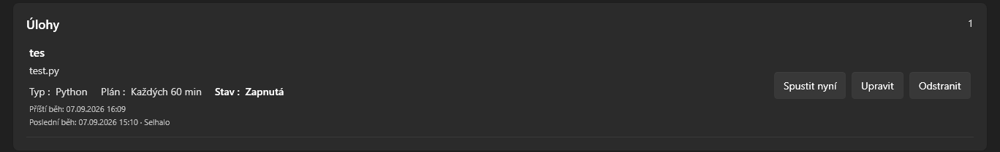 | 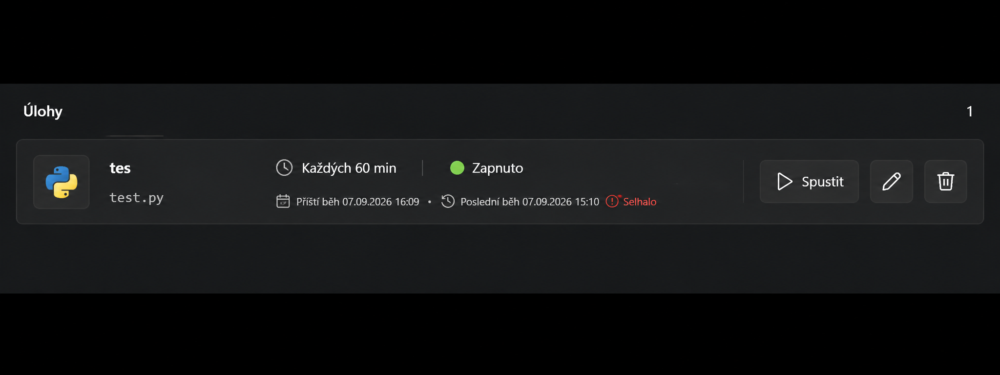 |

Agreed direction:

- Use the technology mark as the task identity; do not repeat the runtime name as a separate metadata row.
- Present schedule and enabled state as compact icon-and-value groups instead of `Typ`, `Plán`, and `Stav` label pairs.
- Keep next and previous run information as subdued timeline metadata; show failure only beside the affected previous run.
- Keep Run as the recognizable icon-and-text primary action. Use pencil and trash glyphs for Edit and Delete.
- Retain every existing action and operational datum, while allowing a semantic icon and its accessible name to replace a duplicated visible word.

Implementation status:

- Tasks now occupy one bounded catalog surface with a shared semantic header, attached count, and one accent New task action.
- Each task row now follows the approved concept with a larger technology identity block, a separate schedule/status block, and a subdued second-line timeline; the redundant runtime-name row is omitted and only the last-run result receives success or failure color.
- Run remains the icon-and-text primary action. Familiar Edit and Delete commands use compact icon buttons with localized tooltips, automation names, stable task identity, and the existing routed handlers.
- The identity/timeline content and the action group reflow independently at local compact breakpoints, while the outer page retains one scroll owner and the bounded task collection keeps its existing viewport.

## Scheduler history

| Current | Direction |
| --- | --- |
| 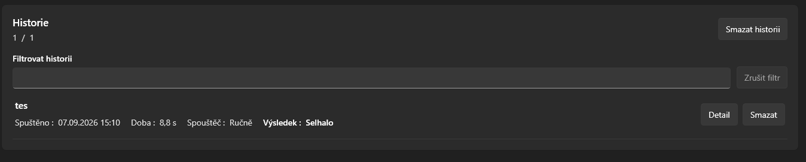 | 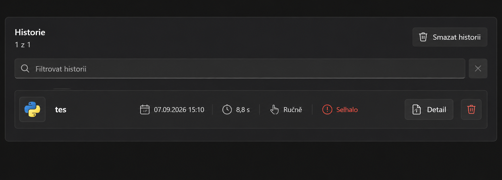 |

Agreed direction:

- Treat filtering as search: place a search glyph and placeholder inside the native input and use a compact clear affordance.
- Keep the visible/total count with the section identity instead of presenting it as an unrelated line.
- Present each record as one flat row: semantic outcome icon, task identity, timestamp, duration, trigger, and actions.
- Use icons to remove the repeated `Spuštěno`, `Doba`, `Spouštěč`, and `Výsledek` captions.
- Keep Detail as an icon-and-text action because it opens a separate surface. Individual deletion may be an icon-only action; clearing all history remains explicit text because of its broader destructive scope.
- Keep the failed-result glyph locally red without repeating its meaning as adjacent text or introducing row selection or a full-width warning background.

Implementation status:

- History now uses the same section-header and catalog-row grammar as tasks, with the visible/total count attached to the heading and project-wide deletion retained as an explicit command.
- The native search input carries a non-interactive search glyph, its existing explanatory help, and a compact icon-and-text clear action; filtering behavior and focus restoration are unchanged.
- Timestamp, duration, and trigger are compact icon-and-value groups. Success and failure use accessible local semantic glyphs and foreground colors without adjacent duplicate labels, tinting, or selecting the whole row.
- History now repeats the task catalog's technology-led identity block and target line. New run records snapshot both command kind and target; legacy records use the current matching task when it still exists.
- The search icon makes the filter purpose self-evident, so neither a separate filter label nor permanent scope text is shown; the scope remains available as the native input tooltip.
- Details and individual Delete remain explicit row actions. Details continues to open the existing resizable modal, and both deletion scopes retain their existing confirmation and scheduler-store boundaries.

## Module catalog

Implementation status:

- Web/database, development, and browser-automation runtimes remain three semantic groups, but each now uses the shared section header with a group icon and attached package count instead of a page-local heading.
- Every runtime row leads with its existing technology mark in one quiet identity surface, followed by name, description, status, version, progress, and one aligned install state/action.
- Download/Install and Installed states share one native Fluent button with semantic install or success glyphs. Existing command wiring, explicit user initiation, pinned catalog, checksum verification, and portable staging are unchanged.
- Potentially ambiguous operation status is neutral rather than always green. Actual progress stays with its package row, and local action groups stack before long descriptions or buttons can collide.
- The introduction and portability guarantee now form one neutral shield callout. A live dark-Fluent check covered all three groups at the restored width without starting a download.

## Ports and PHP extensions

Implementation status:

- Application ports now use one shared form section with recognizable runtime marks, native numeric inputs, local availability text, and one Save/Refresh action footer. The former pseudo-table header and repeated column captions are gone.
- TCP listeners now form a bounded read-only endpoint catalog with one semantic header, attached count, refresh command, and flat divider rows. The refresh result no longer repeats the count or overwrites a scan failure with success-looking text.
- PHP extensions use the same semantic catalog grammar with native checkboxes, a neutral required-extension notice, runtime-version context, and explicit Save plus advanced `php.ini` edit actions.
- The extension route now exposes the same existing save handler as the settings route, so changing a checkbox never leaves the user without a visible commit action.
- The view no longer embeds the generated default-instance `php.ini` path. Configuration generation, portable persistence, supervised Apache restart, and the advanced override file retain their existing service boundaries.

## Terminal and guides

Implementation status:

- The terminal is now one bounded workspace with a semantic session header, current Ready/Running/Interactive state, and the existing console as its single scrollable body; conventional interaction guidance is not repeated in steady state.
- Stop is visible only for an owned interactive session. Clear output is disabled for every running operation and routes through the existing prompt reset, so streamed output and the protected input boundary cannot be invalidated mid-command.
- The terminal remains a standard multiline WPF text input with its existing history, caret protection, Ctrl+C behavior, bounded output, project-relative prompt, service requests, and supervised portable-process path.
- Guides now use one filter surface above a stable master/detail workspace. Categories and search remain native controls; clearing resets both filters through the page model, and the article count stays attached to the catalog heading.
- Article results are flat selectable rows with quiet guide identity and metadata. Empty search and no-selection states use the same reserved list/detail geometry, while the selected article retains one independently scrolling reading surface.
- Article tags remain explicit native buttons that apply the existing tag filter. The embedded catalog, localized Markdown, dynamic local-port substitution, and WPF `FlowDocument` renderer are unchanged.

## Final cross-screen consistency pass

Implementation status:

- The shared package-manager installation surface now uses `FormSection`, and its package catalog uses `SectionHeader`; the three manager variants no longer retain private section-heading markup.
- Package entry values are explicit dependency properties of the reusable package-manager view instead of named child controls. Clear and install actions consume the same bound state, which avoids WPF namescope coupling inside shared content slots.
- Apache effective configuration now uses the shared section header and an adaptive two-part metadata layout that stacks locally before paths or project names become cramped.
- New-project and existing-project registration now share the same form header, labeled-field, help, information, and action-footer grammar as the other application forms.
- Project-template help is derived by the Projects page model from the selected stable template kind instead of reaching into a named selector. Language refresh continues to rebuild the localized choices and now also refreshes the derived description.
- A repository-wide presentation guard covers every feature view and the shared package manager against `DataGrid`, literal foreground/background colors, and reintroduced page-local 17 px section headings.

## Projects screen and application shell

| Current | Direction |
| --- | --- |
| 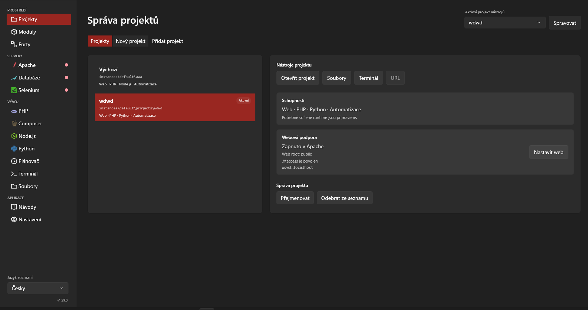 | 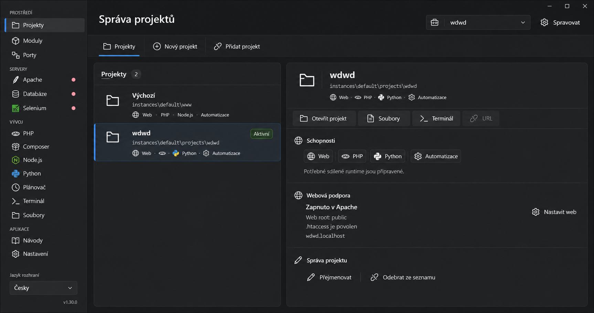 |

Agreed direction:

- Treat the shell, section navigation, master list, and detail pane as one design system rather than styling each feature independently.
- Keep the sidebar neutral. Use a narrow Windows-accent indicator and a subtle selected surface instead of a saturated full-width selection block.
- Use one coherent monochrome Fluent glyph family for navigation and commands. Retain recognizable product colors only for technology identities such as Python, Node.js, or Selenium.
- Present primary page destinations as icon-and-text navigation in one quiet strip. The active destination receives a small accent indicator rather than a filled tab treatment.
- Integrate the active-project selector into the page header with a project/briefcase glyph and one adjacent management action; do not repeat successful context text below it.
- Keep the Projects page as a genuine master/detail workflow. Project rows show identity, portable path, compact capability glyphs, and a small active badge; selection uses a local indicator and subtle surface.
- Build the right pane as one bounded detail surface with internal separators. Header identity, command bar, capabilities, web support, and project management remain sections of the same object instead of nested cards.
- Keep icon-and-text treatment for commands whose meaning or consequence benefits from explicit wording: Open project, Files, Terminal, Configure web, Rename, and Remove from list.
- Distinguish `Remove from list` visually and verbally from filesystem deletion. Do not use a destructive trash metaphor when project files remain untouched.
- In compact mode, stack the detail below the project list and wrap command groups without changing their order or introducing horizontal scrolling.

Implementation status:

- The primary sidebar and shared section navigator now use the same native Fluent selection grammar: a quiet system surface plus a narrow application-accent indicator. Standard `ListBoxItem` templates, focus visuals, keyboard navigation, and automation behavior remain framework-owned.
- Sidebar overflow is confined to the navigation collection. The language selector and version stay pinned, and the scrollbar aligns with the shell edge instead of creating a second page-height scroll region.
- The active-project selector and its management command use the semantic icon catalog. Successful context changes remain implicit in the selector; only actionable project-context failures appear below it.
- The Projects overview now follows the same selection grammar and retains a separate active badge, so inspecting a project cannot be mistaken for activating it. Rows lead with project identity, portable path, and compact capability metadata.
- The selected project renders as one bounded detail object with an identity header, command bar, capabilities, web support, and management sections separated by quiet dividers. The former nested capability and web cards were removed.
- Project commands use the shared semantic icon catalog. `Remove from list` deliberately uses a minus-in-circle symbol instead of a trash glyph because project files remain untouched.

## File manager

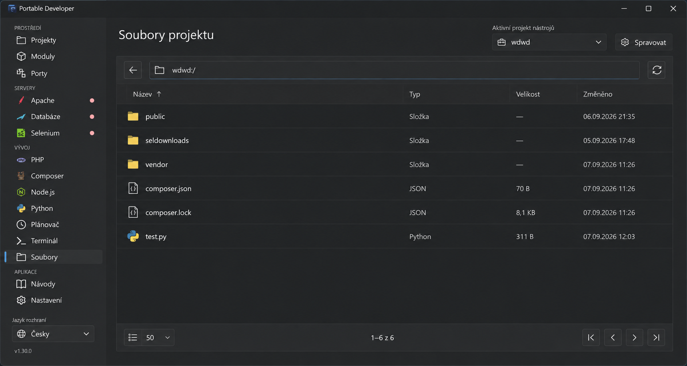

Agreed direction:

- Treat files as a genuine selection workflow. A details view with columns is appropriate here, but it should behave and read like Windows Explorer rather than a generic `DataGrid`.
- Keep Back, the editable project-relative path, and Refresh in one compact location bar. The current directory is the object being navigated, not a separate card.
- Lead every row with a familiar file-type glyph and name. Keep type, size, and modification time subdued and consistently aligned.
- Use one bounded surface for the location bar, column header, file list, and paging footer. Avoid cards around individual files and avoid page-level horizontal scrolling.
- Collapse Size and Modified first at narrow widths. Preserve the file name and type before considering horizontal scrolling.
- Integrate paging into the list footer, with current range and total count together. Disabled navigation remains visible but quiet.
- Selection uses a subtle neutral surface and a narrow application-accent indicator, never a saturated full-row warning color.

Implementation status:

- The location bar, inset sortable details header, file collection, empty state, and paging controls now form one bounded Explorer-like surface instead of unrelated rows and panels. Header and rows share the same horizontal origin and no longer touch the card edge.
- Back, Refresh, paging, folder, and file-kind symbols come from the shared semantic icon catalog. Familiar tertiary navigation is icon-only with localized tooltips and automation names.
- The standard extended-selection `ListBox` remains the interaction owner. Its selected state uses a page-scoped quiet Fluent surface with a narrow accent indicator, without replacing the native item template.
- Name and Type remain visible in compact mode; Size and Modified collapse before the page can require horizontal scrolling. The paging footer keeps its range, total, page-size selector, and disabled navigation together.
- Double-click navigation no longer races click-to-rename. Rename remains explicit through `F2` or the context menu; sorting, context commands, drag and drop, clipboard transfer, paging, and filesystem-service boundaries are unchanged.

## Final accent and focus polish

- Normal light and dark modes inherit the Windows-selected accent and matching on-accent foreground from the native Fluent theme. The application does not override either side of that contrast pair.
- Windows high contrast remains framework-owned without application palette switching code.
- The shared page scrollbar remains keyboard-operable but no longer draws a large focus rectangle around the entire workspace. Interactive controls keep their native focus indication.

## Dialog system

### Compact settings dialog

| Current | Direction |
| --- | --- |
| 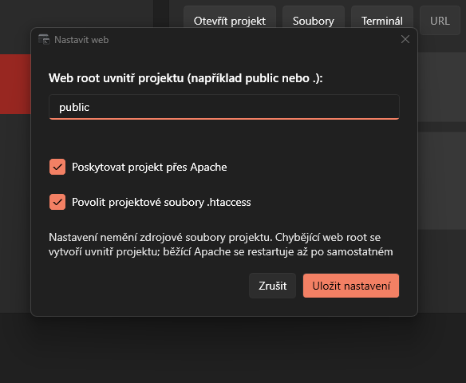 | 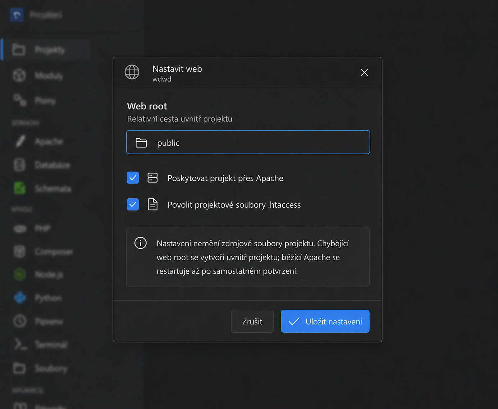 |

### Long form dialog

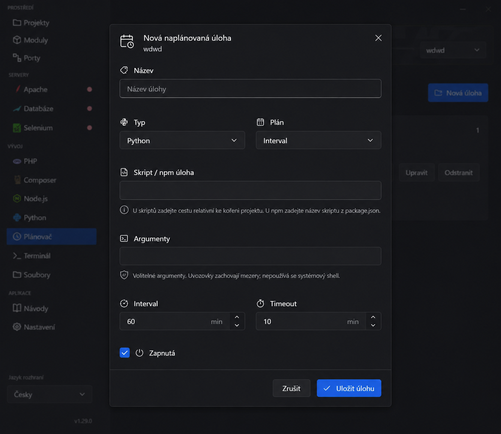

Agreed direction:

- Use an owned native modal with a single Close command. Dialogs do not get Minimize or Maximize unless the content genuinely requires a resizable workspace.
- Start with one header row: a purpose glyph, dialog title, and optional muted context such as the active project. Do not repeat the title inside the body.
- Use 20–24 px content padding and visual groups created by spacing, labels, and separators rather than nested cards.
- Keep labels for unfamiliar values. Icons support scanning but do not replace form labels, checkboxes, validation text, or destructive wording.
- Put short field guidance directly below its control. Use a neutral information callout for cross-field consequences or behavior that applies to the entire dialog.
- A valid untouched field stays neutral. Accent or error borders appear only for focus, active validation, or an actual error.
- Use one footer separated from the body. Cancel is secondary; Save/Create is the single accent action and keeps both glyph and text.
- Preserve native Enter/Escape behavior, focus order, accessibility names, and visible keyboard focus.
- A compact dialog remains one column. A longer form may pair related fields such as Type/Schedule or Interval/Timeout, but those pairs stack at narrow widths.

Implementation status:

- All application dialogs now use one shared purpose header backed by the semantic icon catalog. The window title is not repeated as an unrelated body heading, and optional project context remains visually secondary.
- Compact confirmation, naming, web-settings, and file-conflict dialogs use one-column bodies with 24 px padding and one separated footer. Save/Rename is the single accent action; warnings and destructive consequences retain explicit wording and semantic color.
- Field labels, local help, active validation, secondary buttons, primary buttons, and footer spacing use shared layout styles while standard Fluent inputs, checkboxes, focus visuals, keyboard behavior, and native window chrome remain framework-owned.
- Project web guidance now uses one neutral information callout. Untouched inputs remain neutral; only focus and actual validation produce accent or critical treatment.
- The scheduled-task form owns one body scrollbar and keeps its Cancel/Save footer fixed. Its paired Type/Schedule fields remain aligned without creating a second page scroll owner.
- The run-output dialog is the only resizable reading workspace. It keeps a bounded monospace output viewport and the same header/footer grammar as compact dialogs.
- One compact information dialog now presents optional section guidance on demand. It uses the same semantic header, native accent-aware Close command, Enter/Escape behavior, and bounded scrolling as the rest of the dialog system.

## Shared package manager

Python, Composer, and Node.js are variants of one component, not three independently designed pages.

| Populated Python | Populated Composer | Empty Node.js |
| --- | --- | --- |
| 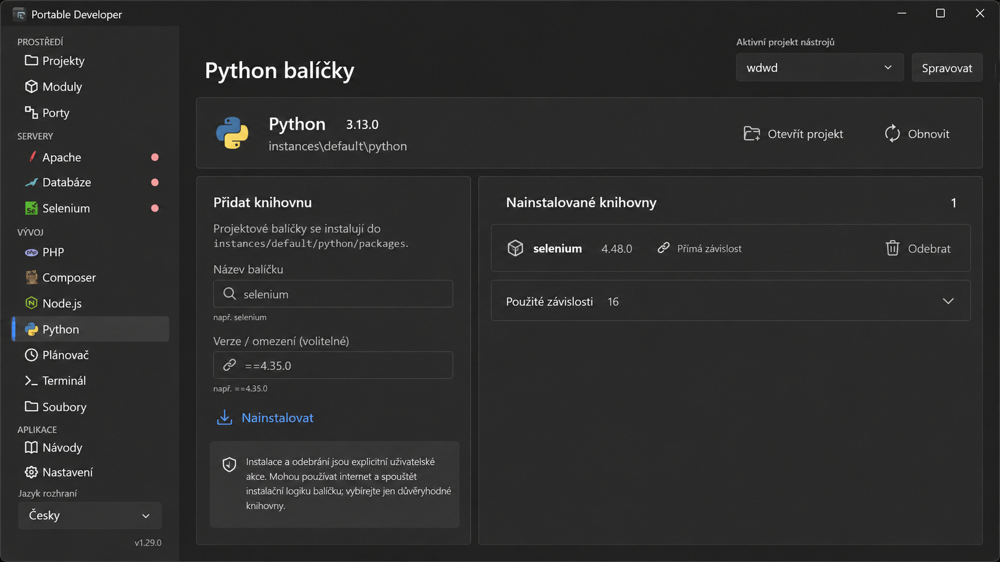 | 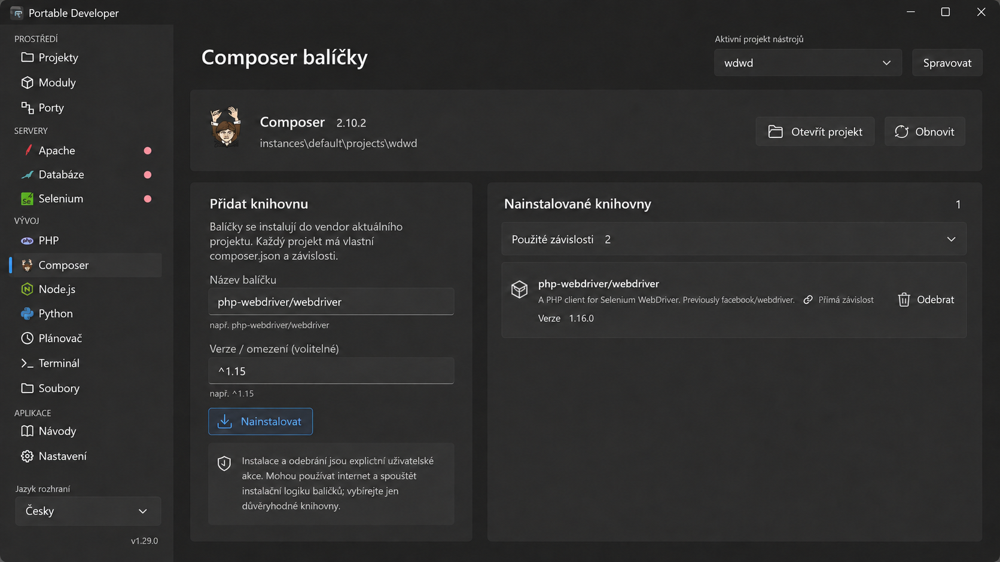 | 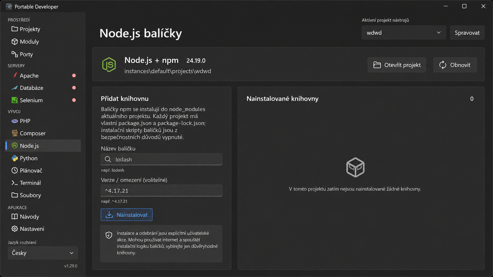 |

Shared structure:

- Use one reusable `PackageManagerPage` composition with four slots: runtime identity, installation guidance, installed-package collection, and operation state.
- The runtime header contains the technology identity, version, portable path, Open project, and Refresh. It is a compact object header rather than another dashboard card.
- Keep installation in the narrower column and the collection in the wider column. Both belong to one workspace and align at their top edge.
- Use the same labeled package and optional-version inputs for every manager. Technology-specific examples and version syntax are data supplied by the page variant.
- Keep Install as the only accent command. It uses a glyph and text and remains visibly button-shaped; it must not degrade into a link.
- Move the manager-specific package-location explanation behind an info action beside the section title; keep the trust/network warning visible because it affects the immediate installation decision.
- Replace the bright yellow warning paragraph with a neutral shield callout. The warning remains readable without competing with actual validation or failure states.
- Render direct packages as flat catalog rows: package glyph, name, optional description, version, direct-dependency marker, and Remove action. Long names trim or wrap inside the identity area instead of moving the action off-screen.
- Show transitive dependencies in a native disclosure row with its count. Expanding it reuses the same package-row component in a denser, read-only form.
- The collection title owns its count. Do not repeat counts in unrelated labels or column headings.
- The empty state occupies the same collection surface as populated data and contains only a quiet package glyph and explanation. It does not repeat the Install action already present beside it.
- Loading, install, and removal progress replace the collection status area or appear as a single inline operation strip. They never create a modal overlay and a second in-page progress indicator simultaneously.
- Keep Install and Remove labels as stable action names while their native buttons are disabled; operation tense, package name, detail, and progress belong only to the inline operation strip.
- At compact widths, stack installation above the collection. Keep package actions reachable without horizontal scrolling and collapse descriptions before identity or version.

Variant data:

| Variant | Package location/context | Version example | Additional guidance |
| --- | --- | --- | --- |
| Python | `instances/default/python/packages` | `==4.35.0` | The portable runtime and Windows user profile remain unchanged. |
| Composer | Current project's `vendor` and `composer.json` | `^1.15` | Preserve direct versus transitive dependency information. |
| Node.js | Current project's `node_modules`, `package.json`, and lock file | `^4.17.21` | State clearly that package installation scripts are disabled. |

The implementation should share layout and state controls while keeping the package-provider service abstractions separate. Empty, loading, populated, validation-error, operation-error, and disabled states must be available to all three variants.

## Runtime service header

Apache, MariaDB, and Selenium share one flat object header because they expose the same managed-service lifecycle. PHP and package managers do not use this component: they are configuration or dependency workspaces rather than independently started services.

Implementation status:

- One reusable `RuntimeHeader` now owns the brand mark, service name, verified version, lifecycle state, explanatory detail, optional endpoint/context, local feedback, and a right-aligned action slot.
- The header is separated from page content by one quiet divider instead of being wrapped in another card. Its identity and action regions reflow through the shared adaptive split without introducing page-level horizontal scrolling.
- Start and stop use the shared semantic play/stop icons inside the standard accent Fluent button. Familiar secondary commands, such as opening Selenium Hub, remain neutral icon-and-text buttons.
- Runtime feedback appears once in the affected header. Existing process ownership, availability checks, command handlers, download behavior, and service safeguards are unchanged.
- A live dark-Fluent check covered Selenium at maximized and restored window sizes without starting the service. The identity, state, endpoint, and both command levels remained readable and aligned.

## Settings form sections

Selenium server settings, PHP configuration, application preferences, and database creation share the same form grammar even though their service abstractions remain separate.

Implementation status:

- A reusable `FormSection` now owns one semantic icon, heading, optional description, body, local feedback, and an optional separated action footer. It composes standard Fluent controls and introduces no input templates.
- Shared field-label, help-text, footer, primary-action, and secondary-action styles replace page-local padding and typography while retaining visible labels and native focus behavior.
- Related numeric fields use the existing adaptive split and stack at compact widths. Checkboxes keep their explanatory text immediately below them, and Save/Create is the single accent action in the section footer.
- The editor preference uses the same section without an artificial action footer because selection persists immediately. PHP keeps Save and Reset distinct, while database creation keeps the protected default schema visible as neutral context.
- MariaDB root-password inputs deliberately stay in the page namescope because WPF `PasswordBox` values are read directly by the existing handler and are never bound or persisted in a presentation model. The section uses the shared visual styles without weakening that boundary.
- Live dark-Fluent checks covered Selenium and the editor preference at maximized and restored widths without saving settings. Both retained readable hierarchy and avoided horizontal overflow.

## Informational and catalog section headers

Settings summaries, database administration, and Selenium catalogs share the same visual identity even when their bodies and actions remain feature-specific.

Implementation status:

- A reusable `SectionHeader` now owns only a semantic icon, heading, optional description, optional count/status metadata, and optional actions. It does not introduce another card, scroll owner, selection state, or feature state.
- Storage, protected-data, About, database connection, root-password, phpMyAdmin, database-catalog, Selenium-driver, profile, vault, and session sections use the same header grammar while retaining their existing bodies and handlers.
- Section commands use standard Fluent buttons with semantic icons. Counts remain attached to collection identity instead of appearing as unrelated values at a card edge.
- `AdaptiveSplitPanel` now accepts an optional local compact breakpoint. The default remains the inherited workspace mode, but nested sections may stack their actions when their own card is narrow even while the outer workspace is still wide.
- A live dark-Fluent check at the restored window width confirmed that the narrow managed-browser card moves Refresh below its identity instead of clipping the heading, while the wider storage header keeps its commands aligned horizontally.
- Selenium browser packages and profile masters now share one browser-led catalog row: a recognizable browser mark anchors identity, version or storage metadata has its own quiet zone, and readiness is communicated as a separate semantic state rather than buried in prose.
- Profile actions remain explicit icon-and-text commands and move below the content at narrow widths. Package progress remains inside the affected package card and continues to use the existing verified, explicitly initiated downloader.
- The section navigator suppresses only its outer focus adorner so returning focus after an installation cannot outline the whole strip; native focus and selection feedback remain on the individual navigation item.

## Component families found in the live UI audit

The open v1.29 preview was inspected only to inventory visual patterns; no commands that start services, download packages, delete data, or save settings were used.

1. **Application shell** — title bar, sidebar, page title, active-project selector, and secondary navigation. It should be implemented once and reused by every page.
2. **Runtime status header** — used by MariaDB, Selenium, Composer, Python, and similar tools. It needs one identity block, compact state/version metadata, and a right-aligned command group without becoming a standalone oversized card.
3. **Section navigation** — currently rendered like tabs on Database, Selenium, Settings, and Guides pages. Use a single quiet navigation strip with an accent indicator and overflow behavior; do not create a different tab style per module.
4. **Settings form section** — Selenium and application settings need consistent labels, help text, numeric inputs, checkboxes, save placement, and one page scrollbar. Inner scroll viewers should not compete with the shell.
5. **Catalog/list row** — projects, packages, databases, profiles, scheduler tasks, and history use the same identity/metadata/actions grammar. Columns are reserved for real comparison or file browsing, not used by default.
6. **Master/detail workspace** — Projects and Guides need a stable list/detail split with a compact stacked fallback. Selection belongs to the master list and must not recolor the entire detail object.
7. **Empty, busy, and result state** — loading Composer data, an empty database catalog, operation progress, and failures need a shared inline state surface. One operation must never produce both an overlay and a second in-page progress card.
8. **Dialog** — compact settings, longer create/edit form, confirmation, and log/detail viewer all share the same header/body/footer contract. Log detail may be resizable because it is a reading workspace; ordinary settings dialogs stay compact.

Cross-screen findings:

- Keep healthy steady-state pages terse. Do not narrate what a visible label, state, value, or action already says; reserve explanatory copy for constraints, recovery, safety, validation, and failures.
- Keep exactly one vertical scroll owner for ordinary pages. Sticky page headers and local list virtualization are allowed, but nested full-page scrollbars are not.
- Stop using large cards as the default layout primitive. A card should represent one coherent object or bounded workspace, not merely provide spacing.
- Use the same command hierarchy everywhere: one accent primary action, neutral secondary actions, icon-only tertiary actions, and an explicit destructive treatment.
- Counts sit beside collection titles; status belongs beside the affected object; contextual project information stays in the page header.
- Empty states reserve the same list/workspace geometry as populated states so the page does not jump when data arrives.

## Review checklist for each migrated component

- Information and actions are unchanged or intentionally improved.
- Wide and compact arrangements are both defined.
- Long identity values trim or wrap intentionally and expose the full value when needed.
- Icon-only actions have tooltips and accessible names in Czech and English.
- Keyboard navigation and visible focus remain native and predictable.
- Light, dark, high-contrast, disabled, empty, busy, success, warning, and failure states are accounted for.
- No `DataGrid`, page-level horizontal scrolling, duplicate status surface, or feature-specific control template is reintroduced.
